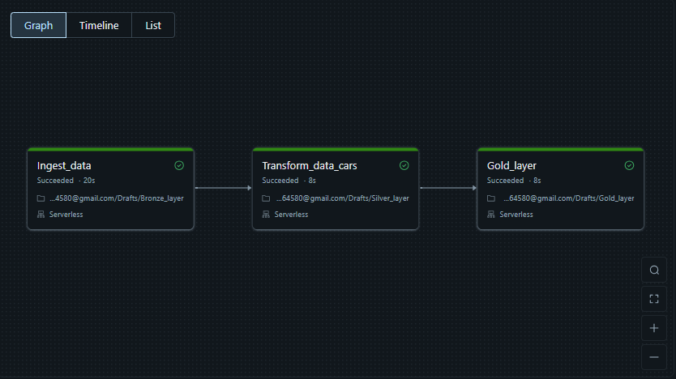
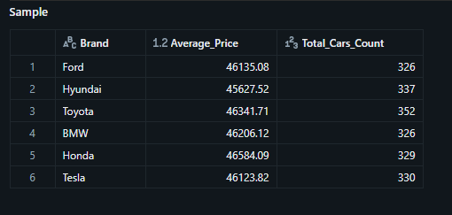

# End-to-End Car Price ETL Pipeline using Databricks Serverless & Unity Catalog

## 📌 Project Overview
This project demonstrates a production-ready, automated data engineering pipeline built using the **Medallion Architecture** (Bronze, Silver, Gold) inside Databricks. The pipeline ingests a car price dataset via PySpark, processes data efficiently using **Databricks Serverless Compute**, secures and governs data assets within the **Unity Catalog**, and orchestrates tasks seamlessly through **Databricks Workflows**.

---

## 📂 Project Structure

```
Databricks-CarPrice-ETL-Pipeline/
│
├── notebooks/                  # Exported Databricks notebooks containing execution source code
│   ├── 01_bronze_layer.py      # Data Ingestion: Reads raw CSV and saves to Unity Catalog
│   ├── 02_silver_layer.py      # Data Transformation: Cleans data, drops duplicates, and adds metadata
│   └── 03_gold_layer.py        # Business Aggregations: Computes metrics and insights by car brand
│
├── images/                     # Project documentation assets
│   └── data_pipeline.png       # Production snapshot confirming successful workflow run
│   └── Gold_layer.png
└── README.md                   # Main documentation landing page
```
🛠️ Tech Stack
Apache Spark / PySpark: Distributed computing engine for scalable data transformations.

Databricks Serverless: Fully managed, instant cloud compute orchestration.

Unity Catalog: Modern data governance, Managed Volumes, and secure table organization.

Delta Lake: Storage layer infrastructure offering ACID transactions and time-travel capabilities.

Databricks Workflows: Task orchestration engine to schedule, monitor, and chain the data pipeline.

📐 Data Pipeline Stages
1️⃣ Bronze Layer (Ingestion)
File Ingested: Raw car_price_dataset.csv uploaded securely into a Unity Catalog Managed Volume.

Processing: PySpark loads the source CSV with inferred schemas and writes it exactly as-is into a raw Delta table: main.default.bronze_cars.

2️⃣ Silver Layer (Transformation & Cleaning)
Processing: Reads from the Bronze table, applies data cleansing rules by removing exact record duplicates (dropDuplicates()), and appends a processing metadata audit column (ingestion_time) utilizing Spark internal timestamp functions.

Storage: Persisted safely as a cleaned, optimized Delta table: main.default.silver_cars.

3️⃣ Gold Layer (Aggregation & Analytical Insights)
Processing: Aggregates data from the refined Silver layer to deliver direct business values. It computes the Average Price (rounded to 2 decimal points) and the Total Count of Available Cars grouped by the automobile Brand.

Storage: Saved into the analytical Delta reporting table: main.default.gold_cars_analysis.

🔄 Pipeline Orchestration (Workflows)
The modular notebooks are tied sequentially using Databricks Workflows ensuring strict dependency routing. Downstream tasks progress sequentially only upon the successful completion of the preceding phase.

### 📈 Project Metrics & Workflow Status

### 📈 Project Metrics & Workflow Status

| Databricks Workflow Status | Gold Layer Sample Data |
| :---: | :---: |
|  |  |

---

### 📐 Data Architecture Diagram
To ensure clear visibility of the data flow, the Medallion Architecture and system orchestration details are mapped out below:


